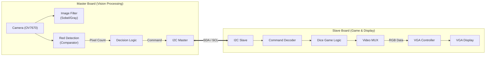

# 🎲 Real-time VGA Processing & Dice Game SoC

<div align="center">


-blue?style=for-the-badge&logo=xilinx&logoColor=white)


<br>

> **Dual-FPGA Architecture based Multimedia System**
>
> 고성능 VGA 디스플레이 컨트롤러, 실시간 객체 인식(Red Detection), 그리고 하드웨어 가속 기반의 주사위 게임 엔진을 탑재한 I2C 기반 FPGA SoC 프로젝트

</div>

---

## 🖥️ 1. 개발 환경 (Environment)

이 프로젝트는 다음 환경에서 설계 및 검증되었습니다.

| Category | Details |
| :--- | :--- |
| **FPGA Board** | Digilent **Basys 3** (Xilinx Artix-7 XC7A35T) |
| **Toolchain** | Xilinx **Vivado Design Suite** (Synthesis & Implementation) |
| **Language** | **SystemVerilog** (IEEE 1800-2012), Verilog HDL |
| **Simulator** | Vivado Simulator / ModelSim |
| **Peripherals** | VGA Monitor (640x480 @ 60Hz), Camera (OV7670), Switches, Buttons |

---

## 📖 2. 프로젝트 개요 (Overview)

이 프로젝트는 **SystemVerilog**를 사용하여 FPGA 상에서 **실시간 영상 처리**와 **인터랙티브 게임**을 구동하는 멀티미디어 시스템입니다.
**Master FPGA**는 카메라 입력을 받아 **특정 색상(Red)을 실시간으로 검출**하고 처리하는 'Vision Processing Unit' 역할을 수행하며, **Slave FPGA**는 I2C로 전달받은 데이터에 따라 주사위 게임을 렌더링하고 VGA로 출력하는 'Display Controller' 역할을 수행합니다.

---

## 💡 3. 핵심 구현 기술 (Core Technologies)

이 프로젝트의 기술적 핵심은 **하드웨어 로직만으로 구현한 실시간 색상 추적 및 객체 크기 계산 알고리즘**입니다.

### 3.1 Red Color Detection Engine (빨간색 검출)
RGB 색상 공간에서 빨간색 영역만을 정확하게 추출하기 위해 비교기(Comparator) 기반의 하드웨어 필터를 설계했습니다. 단순한 임계값 비교가 아닌, R 채널이 G, B 채널보다 압도적으로 높은 경우만을 선별하여 오검출을 최소화했습니다.

* **Algorithm Logic:**
    * 입력 픽셀: $R_{in}, G_{in}, B_{in}$ (각 4-bit)
    * **Condition 1:** Red 채널이 최소 임계값($TH_{min}$)을 넘어야 함.
    * **Condition 2:** Red 값이 Green 값보다 특정 마진($\alpha$) 이상 커야 함.
    * **Condition 3:** Red 값이 Blue 값보다 특정 마진($\beta$) 이상 커야 함.
    * **Output:** 조건 만족 시 `1 (White)`, 불만족 시 `0 (Black)` 출력 (Binary Masking).

```systemverilog
// SystemVerilog Pseudo-code for Red Filter
assign is_red = (r_in > THRESHOLD) && 
                (r_in > g_in + MARGIN) && 
                (r_in > b_in + MARGIN);
````

### 3.2 Pixel Area Counting (픽셀 면적 계산)

검출된 빨간색 객체의 크기를 판단하기 위해, 한 프레임 내에 존재하는 `is_red` 픽셀의 개수를 실시간으로 카운팅합니다.

  * **Real-time Accumulation:**
      * `V-Sync`가 시작될 때 카운터를 0으로 초기화 (`Reset`).
      * `Active Video` 구간에서 `is_red == 1`일 때마다 카운터 증가 (`Accumulate`).
  * **Noise Filtering:**
      * 카메라 노이즈로 인한 미세한 빨간색 점들을 무시하기 위해, 누적된 픽셀 수가 \*\*설정된 임계값(Area Threshold)\*\*을 초과할 때만 유효한 객체로 인식합니다.
      * **Application:** 이 신호는 주사위 게임의 'Start/Stop' 트리거 또는 필터 모드 전환의 스위치로 활용됩니다.

### 3.3 Custom VGA Controller

FPGA 클럭을 분주하여 VGA 표준 타이밍을 준수하는 디스플레이 컨트롤러를 직접 설계했습니다.

  * **Pixel Clock:** 100MHz → **25MHz** 분주 (640x480 @ 60Hz).
  * **Timing Generator:** H-Sync/V-Sync의 Front/Back Porch를 정밀 제어하여 모니터 호환성 확보.
  * **Sync Signals:** Active Area와 Blanking Interval을 정확히 구분하여 노이즈 없는 영상 출력.

-----

## 🏗️ 4. 시스템 아키텍처 (System Architecture)

### 4.1 Hardware Block Diagram

시스템은 \*\*I2C 통신 프로토콜(SDA, SCL)\*\*을 통해 연결된 Master(연산/센싱)와 Slave(디스플레이/게임) 모듈로 구성됩니다.



-----

## 📂 5. 프로젝트 발표 자료 (Presentation)

본 프로젝트의 상세한 아키텍처 설계, 색상 검출 알고리즘 원리 및 시연 결과는 아래 보고서를 통해 확인하실 수 있습니다.

[](https://github.com/seokhyun-hwang/files/blob/main/Real-time-VGA-Processing-Filter-Dice-Game.pdf)

<br>

-----

## 📂 6. 폴더 구조 (Directory Structure)

이 프로젝트는 두 개의 독립적인 FPGA 시스템으로 구성되어 있습니다. **Master Board**는 카메라 입력 및 영상 처리를 담당하며, **Slave Board**는 게임 로직 및 VGA 출력을 담당합니다.

```bash
📦 Real-time-VGA-Processing-Filter-Dice-Game
 ├── 📂 Master_Board               # [Processing System] 카메라 및 영상 처리
 │   ├── 📂 src
 │   │   ├── 📜 master_top.sv      # [Top] Master System Wrapper
 │   │   ├── 📜 control_fsm.sv     # Main Control Logic
 │   │   ├── 📜 i2c_master.sv      # I2C Protocol Transmitter
 │   │   ├── 📂 video_in           # 카메라 입력 로직
 │   │   │   └── 📜 ov7670_capture.sv
 │   │   └── 📂 processing         # [Core] 영상 처리 알고리즘
 │   │       ├── 📜 red_detection.sv   # Red Color Detector & Comparator
 │   │       ├── 📜 image_filter.sv    # Sobel / Gray / Invert Filters
 │   │       └── 📜 pixel_counter.sv   # Area Calculation Logic
 │   └── 📂 constrs
 │       └── 📜 Master_Basys3.xdc  # Pin Constraints for Master
 │
 ├── 📂 Slave_Board                # [Display System] 게임 및 VGA 출력
 │   ├── 📂 src
 │   │   ├── 📜 slave_top.sv       # [Top] Slave System Wrapper
 │   │   ├── 📜 i2c_slave.sv       # I2C Protocol Receiver
 │   │   ├── 📂 display_core       # 디스플레이 관련 로직
 │   │   │   ├── 📜 vga_controller.sv  # VGA Timing Generator
 │   │   │   └── 📜 video_mux.sv       # Output Selector
 │   │   └── 📂 game_logic         # 게임 엔진
 │   │       ├── 📜 dice_game_fsm.sv   # Dice Game State Machine
 │   │       └── 📜 dice_renderer.sv   # Dice Sprite Renderer
 │   └── 📂 constrs
 │       └── 📜 Slave_Basys3.xdc   # Pin Constraints for Slave
 │
 ├── 📂 Docs                       # 문서 및 발표 자료
 │   └── 📜 Real-time-VGA-Processing-Filter-Dice-Game.pdf
 └── 📜 README.md
```

-----

## 🚀 7. 실행 및 검증 (How to Run)

### 하드웨어 설정 (Hardware Setup)

1.  **Master Board:** OV7670 카메라를 PMOD 포트에 연결하고 스위치를 통해 필터 모드를 설정합니다.
2.  **Slave Board:** VGA 모니터를 연결하여 게임 화면을 출력합니다.
3.  **Connection:** 두 보드 간의 **I2C 라인 (SDA, SCL)** 및 Ground를 서로 연결합니다.

### 조작 방법 (Controls)

  * **Master Board:**
      * **Switch 0\~2:** 영상 필터 모드 변경 (Gray, Invert, Sobel).
      * **Switch 3:** **Red Detection Mode (ON/OFF).**
  * **Slave Board:**
      * **Monitor:** 마스터에서 빨간색 물체가 감지되면 자동으로 주사위가 굴러갑니다(Roll).

-----

Copyright ⓒ 2025. SEOKHYUN HWANG. All rights reserved.

```
```
