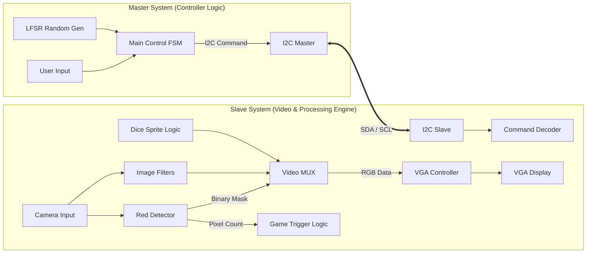

# 🎲 Real-time VGA Processing & Dice Game SoC


-blue?style=flat&logo=fpga)


> **Dual-FPGA Architecture based Multimedia System**
>
> 고성능 VGA 디스플레이 컨트롤러, 실시간 객체 인식(Red Detection), 그리고 하드웨어 가속 기반의 주사위 게임 엔진을 탑재한 I2C 기반 FPGA SoC 프로젝트

---

## 🖥️ 1. 개발 환경 (Environment)

이 프로젝트는 다음 환경에서 설계 및 검증되었습니다.

| Category | Details |
| :--- | :--- |
| **FPGA Board** | Digilent **Basys 3** (Xilinx Artix-7 XC7A35T) |
| **Toolchain** | Xilinx **Vivado Design Suite** (Synthesis & Implementation) |
| **Language** | **SystemVerilog** (IEEE 1800-2012), Verilog HDL |
| **Simulator** | Vivado Simulator / ModelSim |
| **Peripherals** | VGA Monitor (640x480 @ 60Hz), Camera (OV7670), Switches, Buttons |

---

## 📖 2. 프로젝트 개요 (Overview)

이 프로젝트는 **SystemVerilog**를 사용하여 FPGA 상에서 **실시간 영상 처리**와 **인터랙티브 게임**을 구동하는 멀티미디어 시스템입니다.
단순한 필터 적용을 넘어, 입력된 비디오 스트림에서 **특정 색상(Red)을 실시간으로 검출**하고, **검출된 픽셀의 면적(Area)을 계산**하여 이를 시스템의 제어 신호(Trigger)로 활용하는 고급 영상 처리 기술을 구현했습니다.

시스템은 **제어(Master)**와 **연산(Slave)**이 분리된 이원화 아키텍처로 구성되어 있으며, 두 모듈 간의 통신은 **I2C 프로토콜**을 사용하여 안정적인 커맨드 전송을 보장합니다.

---

## 💡 3. 핵심 구현 기술 (Core Technologies)

이 프로젝트의 기술적 핵심은 **하드웨어 로직만으로 구현한 실시간 색상 추적 및 객체 크기 계산 알고리즘**입니다.

### 3.1 Red Color Detection Engine (빨간색 검출)
RGB 색상 공간에서 빨간색 영역만을 정확하게 추출하기 위해 비교기(Comparator) 기반의 하드웨어 필터를 설계했습니다. 단순한 임계값 비교가 아닌, R 채널이 G, B 채널보다 압도적으로 높은 경우만을 선별하여 오검출을 최소화했습니다.

* **Algorithm Logic:**
    * 입력 픽셀: $R_{in}, G_{in}, B_{in}$ (각 4-bit)
    * **Condition 1:** Red 채널이 최소 임계값($TH_{min}$)을 넘어야 함.
    * **Condition 2:** Red 값이 Green 값보다 특정 마진($\alpha$) 이상 커야 함.
    * **Condition 3:** Red 값이 Blue 값보다 특정 마진($\beta$) 이상 커야 함.
    * **Output:** 조건 만족 시 `1 (White)`, 불만족 시 `0 (Black)` 출력 (Binary Masking).

```systemverilog
// SystemVerilog Pseudo-code for Red Filter
assign is_red = (r_in > THRESHOLD) && 
                (r_in > g_in + MARGIN) && 
                (r_in > b_in + MARGIN);
````

### 3.2 Pixel Area Counting (픽셀 면적 계산)

검출된 빨간색 객체의 크기를 판단하기 위해, 한 프레임 내에 존재하는 `is_red` 픽셀의 개수를 실시간으로 카운팅합니다.

  * **Real-time Accumulation:**
      * `V-Sync`가 시작될 때 카운터를 0으로 초기화 (`Reset`).
      * `Active Video` 구간에서 `is_red == 1`일 때마다 카운터 증가 (`Accumulate`).
  * **Noise Filtering:**
      * 카메라 노이즈로 인한 미세한 빨간색 점들을 무시하기 위해, 누적된 픽셀 수가 \*\*설정된 임계값(Area Threshold)\*\*을 초과할 때만 유효한 객체로 인식합니다.
      * **Application:** 이 신호는 주사위 게임의 'Start/Stop' 트리거 또는 필터 모드 전환의 스위치로 활용됩니다.

### 3.3 Custom VGA Controller

FPGA 클럭을 분주하여 VGA 표준 타이밍을 준수하는 디스플레이 컨트롤러를 직접 설계했습니다.

  * **Pixel Clock:** 100MHz → **25MHz** 분주 (640x480 @ 60Hz).
  * **Timing Generator:** H-Sync/V-Sync의 Front/Back Porch를 정밀 제어하여 모니터 호환성 확보.
  * **Sync Signals:** Active Area와 Blanking Interval을 정확히 구분하여 노이즈 없는 영상 출력.

-----

## 🏗️ 4. 시스템 아키텍처 (System Architecture)

### 4.1 Hardware Block Diagram

시스템은 \*\*I2C 통신 프로토콜(SDA, SCL)\*\*을 통해 연결된 Master(제어)와 Slave(영상/게임) 모듈로 구성됩니다.



### 4.2 Image Processing Pipeline

게임 모드가 아닐 때는 다양한 실시간 필터링을 수행합니다.

1.  **Red Extract:** 위에서 설명한 알고리즘을 통해 특정 색상 추출 및 이진화.
2.  **Grayscale:** 인간 시각 특성을 고려한 가중치 적용 ($Y = 0.299R + 0.587G + 0.114B$).
3.  **Inversion:** RGB 비트 반전을 통한 네거티브 효과.
4.  **Sobel Edge:** 3x3 라인 버퍼(Line Buffer)를 이용한 실시간 윤곽선 검출.

-----

## 📂 5. 폴더 구조 (Directory Structure)

```bash
📦 Real-time-VGA-Processing-Filter-Dice-Game
 ├── 📂 Master                   # [Controller System]
 │    ├── 📜 master_top.sv       # Master 최상위 모듈
 │    ├── 📜 control_fsm.sv      # 메인 제어 및 LFSR 난수 로직
 │    ├── 📜 i2c_master.sv       # I2C 마스터 컨트롤러 (명령 송신)
 │    └── 📜 btn_debounce.sv     # 입력 신호 안정화
 ├── 📂 Slave                    # [Display & Processing System]
 │    ├── 📜 slave_top.sv        # Slave 최상위 모듈
 │    ├── 📜 vga_controller.sv   # [Core] VGA 타이밍 생성기
 │    ├── 📜 red_detection.sv    # [Core] 적색 검출 및 픽셀 카운터
 │    ├── 📜 image_filter.sv     # 영상 필터 (Sobel/Gray/Inv)
 │    ├── 📜 dice_gen.sv         # 주사위 스프라이트 렌더링
 │    ├── 📜 i2c_slave.sv        # I2C 슬레이브 컨트롤러 (명령 수신)
 │    └── 📜 video_mux.sv        # 출력 화면 선택
 └── 📜 README.md                # 프로젝트 문서
```

-----

## 🚀 6. 실행 및 검증 (How to Run)

### 하드웨어 설정 (Hardware Setup)

1.  **FPGA Board:** Digilent Basys 3 (Xilinx Artix-7).
2.  **Display:** VGA 케이블을 사용하여 모니터와 보드를 연결.
3.  **Camera:** OV7670 등의 카메라 모듈 연결 (PMOD 포트 사용).
4.  **Connection:** Master와 Slave 보드 간의 \*\*I2C 라인 (SDA, SCL)\*\*을 연결합니다. (필요 시 풀업 저항 확인)

### 조작 방법 (Controls)

  * **Mode Control:**
      * **Button Center:** 주사위 게임 모드 진입 / 굴리기.
  * **Video Filter Selection:**
      * **Switch 0:** Grayscale Mode.
      * **Switch 1:** Inversion Mode.
      * **Switch 2:** Sobel Edge Detection.
      * **Switch 3:** **Red Color Detection Mode (Object Recognition).**

-----

> *Developed by [hyun1006](https://www.google.com/search?q=https://github.com/hyun1006)*

```
```
